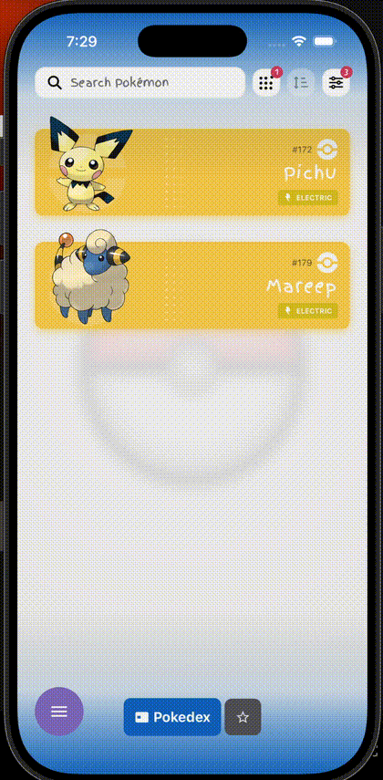
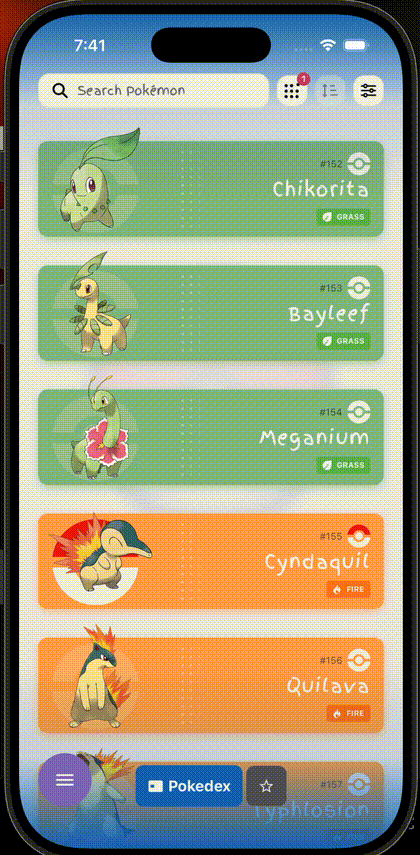

# Pokédex App

> A high-performance, mobile-first Pokédex built with Expo + React Native, designed to showcase polished UI/UX, thoughtful architecture, and multilingual support (`en`, `es`, `de`, `ja`).

> [!WARNING]
> This project is currently **WIP (Work in Progress)**. More features and refinements are actively being added.

<p align="center">
  
  
  
</p>

<p align="center">
  
  
  
</p>

[](https://github.com/AlanCasal/pokemon-flashlist-swipe)
[](https://github.com/AlanCasal/pokemon-flashlist-swipe/commits/main)

### Core Stack

[](https://www.typescriptlang.org/)
[](https://expo.dev/)
[](https://reactnative.dev/)
[](https://react.dev/)
[](https://bun.sh/)

### Key Libraries

[](https://docs.expo.dev/router/introduction/)
[](https://shopify.github.io/flash-list/)
[](https://tanstack.com/query/latest)
[](https://zustand.docs.pmnd.rs/)
[](https://clerk.com/)
[](https://docs.swmansion.com/react-native-reanimated/)
[](https://gorhom.dev/react-native-bottom-sheet/)
[](https://github.com/mrousavy/react-native-mmkv)

### AI Workflow

[](https://openai.com/codex/)
[](https://openai.com/codex/)
[](https://code.visualstudio.com/)

## Project Health

[](#project-health)

<!-- [](#project-health) -->

<!--
Future dynamic test badge template (GitHub Actions):
[](https://github.com/AlanCasal/pokemon-flashlist-swipe/actions)

Future dynamic coverage badge templates:
[](https://codecov.io/gh/AlanCasal/pokemon-flashlist-swipe)
[](https://coveralls.io/github/AlanCasal/pokemon-flashlist-swipe)
-->

## Why This Project Stands Out

- ⚡ **Performance-first list rendering** with FlashList and smooth scrolling behavior.
- 🎨 **Strong visual direction** inspired by a dedicated Figma UI guide.
- 🧠 **Thoughtful state + data flow** using React Query, Zustand, and MMKV persistence.
- 🔐 **Modern authentication flows** powered by Clerk with email and Google sign-in.
- 🧩 **Scalable architecture** with feature-based structure, reusable components, and hooks.
- 🤖 **AI-accelerated development** using Codex App + Codex 5.4 as coding copilot.

## Current Features

- ✨ Animated home experience with marquee Pokémon sprites.
- 📱 Tab-based navigation (Pokédex + Saved) powered by Expo Router.
- 🔐 Clerk authentication with email flows and Google sign-in.
- 🔎 Search + filter + generation + sort workflows in the Pokédex screen.
- 📊 Pokémon detail screen with **About**, **Stats**, and **Evolution** tabs.
- ⭐ Save/unsave Pokémon with local persistence.
- 🌍 Internationalization with in-app language switching: English (`en`), Español (`es`), Deutsch (`de`), 日本語 (`ja`).
- 🎬 Rich motion via Reanimated and polished bottom-sheet interactions.

## WIP: In Progress / Next

- 🚧 Ongoing feature additions and UX polish.
- 🧪 Continued test coverage expansion.
- 🧬 Evolution-chain data quality fixes.
- 🪟 UI refinements for tab/bar behavior across iOS and Android.
- 🌍 Additional locale expansion beyond current `en` / `es` / `de` / `ja` support.

## Tech & AI Stack

### Languages & Runtime

- TypeScript
- JavaScript
- React 19.2.0
- React Native 0.83.2
- Expo 55.0.6
- Bun 1.3.4

### Core Packages

- `expo-router`
- `@shopify/flash-list`
- `@tanstack/react-query`
- `@clerk/clerk-expo`
- `zustand`
- `react-native-reanimated`
- `@gorhom/bottom-sheet`
- `react-native-mmkv`
- `expo-image`
- `expo-linear-gradient`
- `i18next`
- `react-i18next`
- `expo-localization`

### Internationalization

- Device language is resolved with `expo-localization` and mapped to supported app locales.
- Translation resources are managed with `i18next` + `react-i18next`.
- The language preference is persisted locally, with English (`en`) as fallback.

### Authentication

- Authentication is powered by Clerk.
- Users can sign in with email-based flows or continue with Google OAuth.
- Auth state is available across the app for protected and public route experiences.

### AI Tools Used

- Codex App
- Codex 5.4, GPT-4

## Quick Start

```bash
bun install
bun run start
```

Run on device/simulator:

```bash
bun run ios
bun run android
```

Format + lint:

```bash
bun run format:fix
```

Test coverage:

```bash
bun run test:coverage
```

Open the local HTML coverage report at `coverage/lcov-report/index.html`.

## Sources

- [Figma UI Guide](https://www.figma.com/design/dmZL7AGoSOpu8Lh2RXAXi2/Pok%C3%A9dex--Fox-%F0%9F%A6%8A-?node-id=18241-2789&t=zehKinBHAs9D14pk-1)
- [Charmander](https://imgur.com/charmander-chasing-his-tail-f21JG84) chasing his tail

## Contact

- LinkedIn: [linkedin.com/in/alancasal](https://www.linkedin.com/in/alancasal/)
- Email: [alan.casal.dev@gmail.com](mailto:alan.casal.dev@gmail.com)

<p align="center">
  
</p>
